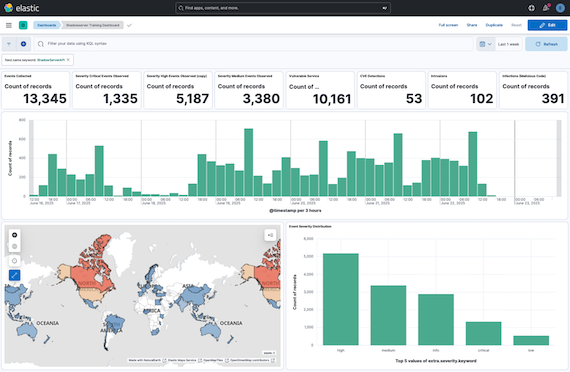

This is the Readme page for the **intelmq-docker** image that is pre-configured for Shadowserver feeds and includes IntelMQ, Elasticsearch, Logstash, and Kibana.

* https://interchange.shadowserver.org/image/docker/shadowserver-intelmq-v3.5.0.tb2 (1.4GB)

An API key is required and can be obtained by visiting https://www.shadowserver.org/contact/ and selecting _Report API Key Request_ under *What is this about?*.

# Details

## IntelMQ

| | |
| --- | --- |
| URL | http://{IP}:8080/intelmq-manager/ |
| Login | `admin` |
| Password | `secret` |

| | |
| --- | --- |
| URL | http://{IP}:8001 |
| Login | `fody` |
| Password | `secret` |

## Kibana

| | |
| --- | --- |
| URL | http://{IP}:5601/ |
| Login | `elastic` |
| Password | `51g*bnP6mDclGvpuA_jv` |

# Install

> `bzcat shadowserver-intelmq-v3.5.0.tb2 | docker import - intelmq-demo`

# Run

> `docker run -p 8080:80 -p 5601:5601 -p 8001:8001 -it intelmq-demo /start`

It will take a few minutes for all the services to start up and begin downloading data.

# Process

1) Start the virtual machine

2) Login to intelmq-manager

3) Select **Configuration**

4) Select ShadowServerAPI-Collector and click _Edit Bot_

5) Set the api_key and secret.

6) Scroll to the bottom and click _OK_.

7) Click _Save Configuration_

8) Select **Management**

9) Under **Whole Botnet Status:** click Start

10) Login to Kibana

11) From the drop-down menu, select _Dashboards_ under **Analytics**

12) Click _Shadowserver Training Dashboard_

