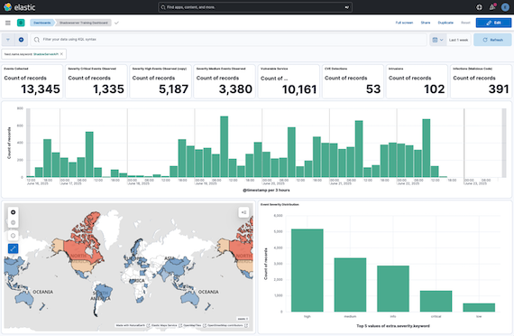

This is the Readme page for the **intelmq-vm** image that is pre-configured for Shadowserver feeds and includes IntelMQ, Elasticsearch, Logstash, and Kibana.

* https://interchange.shadowserver.org/image/ovf/v3.5.0/intelmq-vm-0.vmdk (3.1GB)
* https://interchange.shadowserver.org/image/ovf/v3.5.0/intelmq-vm.mf (66B)
* https://interchange.shadowserver.org/image/ovf/v3.5.0/intelmq-vm.ovf (15KB)

An API key is required and can be obtained by visiting https://www.shadowserver.org/contact/ and selecting _Report API Key Request_ under *What is this about?*.

This VM can be adapted to production use by removing the ShadowServerAPI-Collector `reports: test` setting and migrating the /opt/elasticsearch/data and /var/lib/postgresql directories to additional storage.

It is recommended to run this image in an isolated environment.

The virtual machine is configured for DHCP.

 
# Details

## Versions

| | |
| --- | --- |
| Ubuntu | 24.04.3 LTS |
| IntelMQ | 3.5.0 |

## Logins

The system will display a generated password on the console.

| Service | URL | Login |
| --- | --- | --- |
| Console | | `intelmq`
| IntelMQ | http://{IP}/intelmq-manager/ | `admin`
| Fody | http://{IP}:8001/ | `fody`
| Kibana | http://{IP}:5601/ | `admin`

# Process

1) Start the virtual machine

2) Login to intelmq-manager

3) Select **Configuration**

4) Select ShadowServerAPI-Collector and click _Edit Bot_

5) Set the api_key and secret.

6) Scroll to the bottom and click _OK_.

7) Click _Save Configuration_

8) Select **Management**

9) Under **Whole Botnet Status:** click Start

10) Login to Kibana

11) From the drop-down menu, select _Dashboards_ under **Analytics**

12) Click _Shadowserver Training Dashboard_

