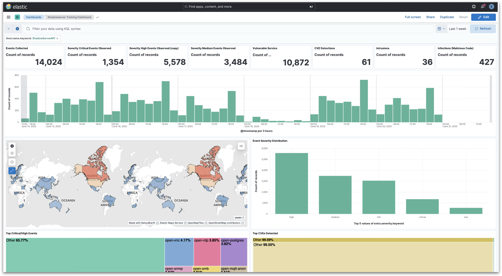
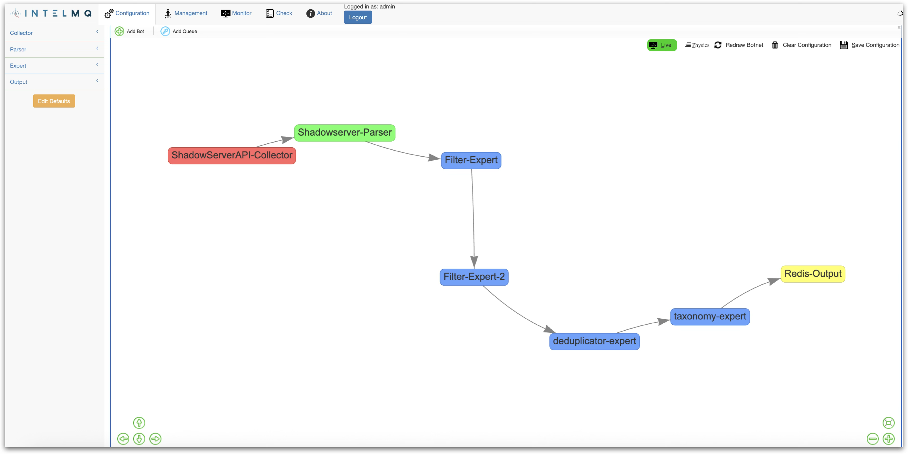
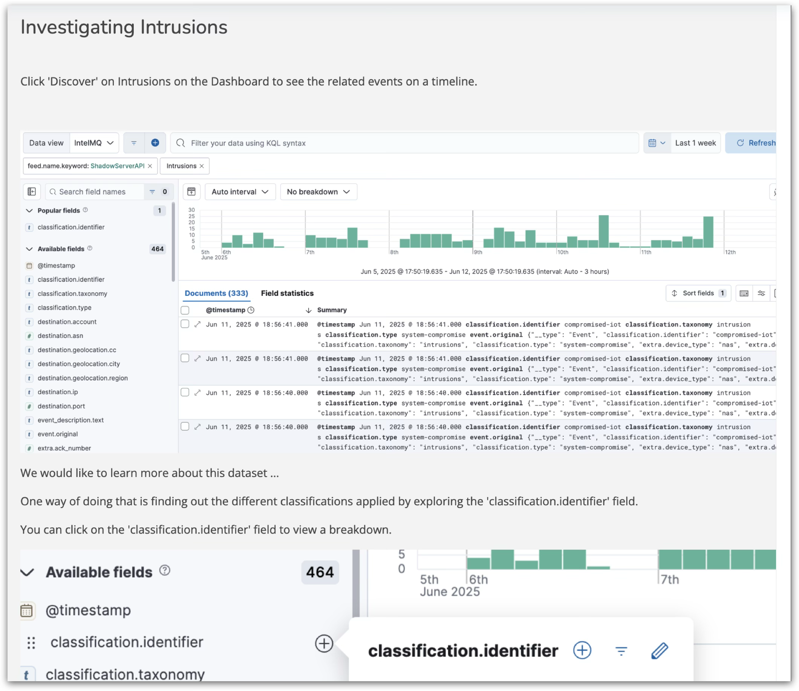
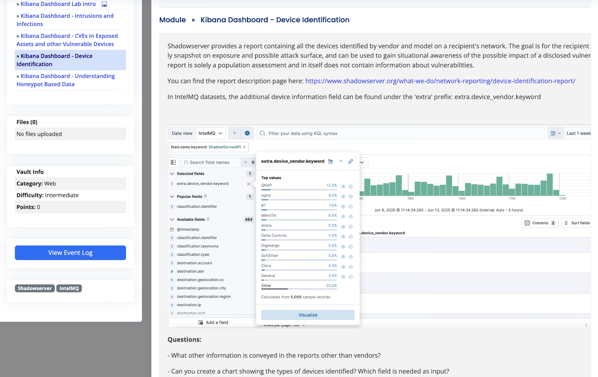

## "Shadowserver-in-a-box" IntelMQ + ELK Solution

This project contains VMs/containers with an installation of IntelMQ (https://github.com/certtools/intelmq) configured to ingest Shadowserver feeds and log the events into an ELK stack.

It can be used for trainings on Shadowserver feeds as well as in production when configured with an API key for an organization's network or constituency. 

You can request a test API key via the form at https://www.shadowserver.org/contact/ 

If you would like to use the IntelMQ + ELK in a box solution for data for your network and constituency and you do not have a production API key from us yet, you can request one at https://www.shadowserver.org/what-we-do/network-reporting/get-reports/

We also offer free online self-trainings on using IntelMQ + ELK for vetted organizations/individuals, in partnership with FIRST.org (https://www.first.org). If you are interested in online remote access, please contact us via the form at https://www.shadowserver.org/contact/

Free on-site trainings are also possible (travel/accommodation costs need to be reimbursed). 

The "Shadowserver in a box" IntelMQ + ELK VM/Docker was supported by the cyber capacity building project under the ECOWAS-G7 partnership for cybersecurity, the “Joint Platform for Advancing Cyber Security” (JPAC) in West Africa. The project was launched by the ECOWAS Commission in collaboration with Germany’s G7 presidency in 2022 and commissioned by the German Federal Foreign Office and the European Union Commission in 2023   

